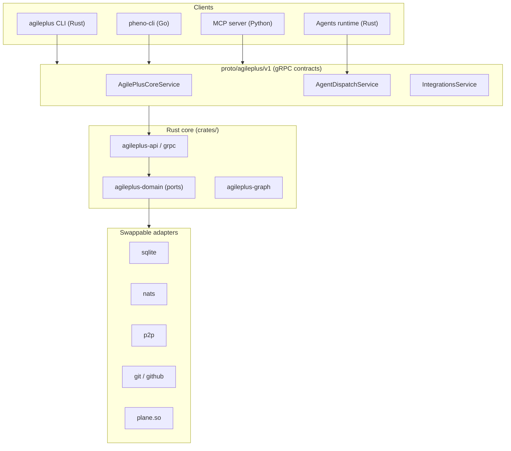
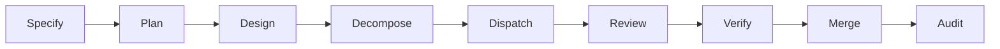

# AgilePlus

**Spec-driven development engine** — from specification to shipped feature, governed, auditable, and agent-ready.

[](https://github.com/KooshaPari/AgilePlus)

AgilePlus is a monorepo housing a 9-phase governed pipeline that takes a feature from specification through to a merged change. Every state transition is auditable and immutable. It is designed agent-first: structured prompts, governance constraints, and harness integration let you dispatch work to Claude Code, Cursor, or custom agents.

> [!NOTE]
> This repository is a **polyglot monorepo** (Rust core + Python MCP server + Go CLI + protobuf contracts + VitePress docs). The earlier README described only the `proto/` subset — see [Repository Layout](#repository-layout) below for the full picture.

## What's in the box

| Component | Language | Path | Purpose |
|-----------|----------|------|---------|
| **Core engine** | Rust | `crates/` (`agileplus-domain`, `-api`, `-grpc`, `-graph`, …) | Port-based domain core: feature lifecycle, governance, audit, sync, triage, storage adapters (SQLite/NATS/P2P) |
| **CLI** | Rust | `crates/agileplus-cli`, `crates/agileplus-subcmds` | `agileplus` command-line interface |
| **pheno-cli** | Go | `pheno-cli/` | Companion Go CLI + git hooks |
| **MCP server** | Python | `agileplus-mcp/` | Model Context Protocol server exposing AgilePlus to agents |
| **Agents runtime** | Rust | `agileplus-agents/` | Agent spawn + review-loop orchestration |
| **Protocol contracts** | protobuf | `proto/agileplus/v1/` | gRPC service + message definitions (single source of truth for inter-service contracts) |
| **Rust/Python stubs** | Rust, Python | `rust/`, `python/` | Generated tonic/prost + grpcio bindings for the proto contracts |
| **Docs** | VitePress | `docs/` | 51-page multi-audience documentation site (Agents / Developers / PMs / SDK consumers) |
| **Templates / prompts** | — | `templates/`, `prompts/`, `agileplus-specs/` | Spec templates and structured agent prompts |

## Architecture



## The 9-phase pipeline



Each state transition is governed and recorded as an immutable audit entry.

## Getting Started

### Prerequisites

- Rust toolchain (core engine, CLI)
- Go 1.21+ (pheno-cli)
- Python 3.12+ with [uv](https://docs.astral.sh/uv/) (MCP server, proto stubs)
- [buf](https://buf.build/docs/installation) v2+ (proto lint/codegen)
- [Bun](https://bun.sh) (docs)

### Build the core engine + CLI

```bash
cargo build --workspace
cargo test --workspace
```

### Run the MCP server

```bash
cd agileplus-mcp && uv sync && uv run python -m agileplus_mcp
```

### Build pheno-cli

```bash
cd pheno-cli && go build ./...
```

### Develop the docs

```bash
npm install
npm run dev
```

## Protocol Contracts (`proto/`)

The `proto/agileplus/v1/` directory is the single source of truth for all inter-service contracts.

| File | Service / contents |
|------|--------------------|
| `common.proto` | Shared message types (Feature, AuditEntry, …) |
| `core.proto` | `AgilePlusCoreService` — feature lifecycle, governance, audit |
| `agents.proto` | `AgentDispatchService` — agent spawn, review loop |
| `integrations.proto` | `IntegrationsService` — Plane.so, GitHub, triage |

```bash
make lint        # buf lint
make generate    # regenerate Rust + Python stubs
make breaking    # buf breaking-change check against main
```

**Breaking-change policy:** proto changes are checked against `main` with `buf breaking`. Breaking changes require a module version bump (`v1` → `v2`), PR documentation, and coordination with all downstream consumers.

## Documentation

The full documentation site lives in `docs/` (VitePress). It is multi-audience: a module switcher filters content by role (Agents, Developers, PMs, SDK consumers). See `docs/index.md` for the entry point and `docs/guide/getting-started.md` to start.

> [!EMBED] STUB — quick-start walkthrough recording
> A recorded `agileplus` quick-start journey (spec → dispatch → merge) belongs here. Pending rich-embed pipeline (#966).

## Contributing

See [`AGENTS.md`](./AGENTS.md) and [`CLAUDE.md`](./CLAUDE.md) for agent governance and contributor workflow.

1. Make changes in the relevant component directory.
2. For proto changes: `make lint && make generate && make breaking`.
3. For Rust: `cargo test --workspace && cargo clippy --workspace -- -D warnings`.
4. Submit a PR — CI runs lint, breaking-change detection, and build checks.
