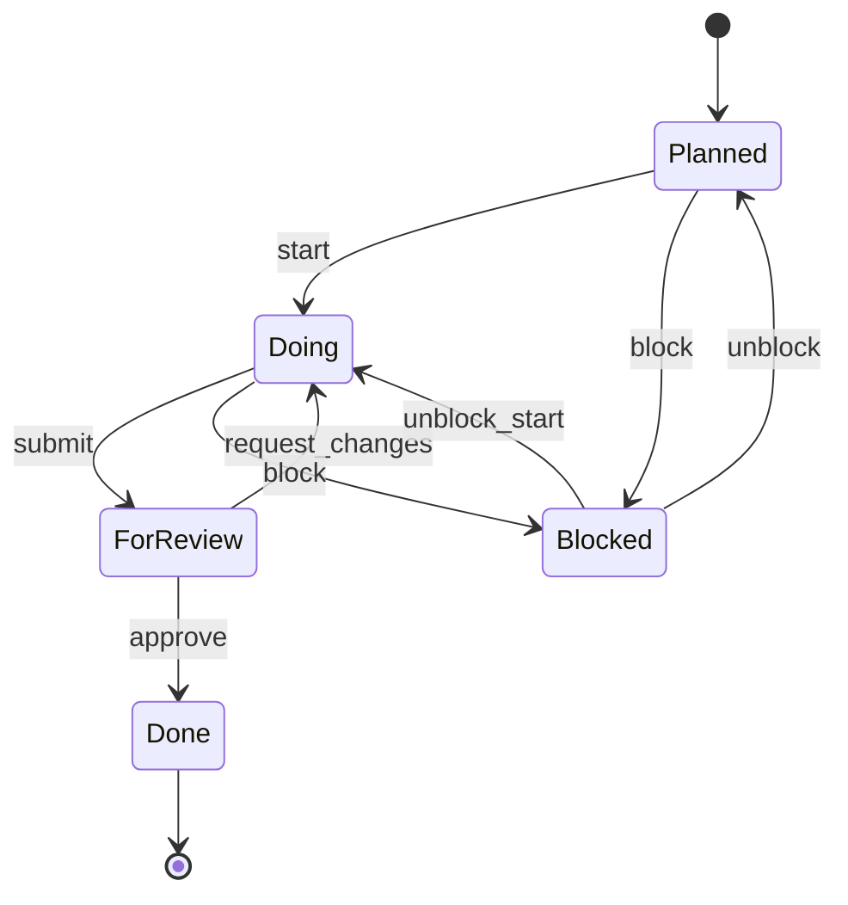

# GOVERNANCE.md — AgilePlus Governance Framework

**Version**: 1.0 | **Status**: Phase 3 Complete | **Last Updated**: 2026-04-02

## Overview

AgilePlus governance is **infrastructure, not paperwork**. Every action produces an immutable record. Every transition is enforced by the system.

This document defines the governance framework for:
- Policy rules and evaluation
- Evidence collection and validation
- Work package status tracking
- Feature lifecycle enforcement
- Integration with GitHub (PR status, checks)

---

## Architecture

```
┌─────────────────────────────────────────────────────────────────────────┐
│                         GOVERNANCE LAYER                                 │
├─────────────────────────────────────────────────────────────────────────┤
│  ┌─────────────┐  ┌─────────────┐  ┌─────────────┐  ┌─────────────────┐ │
│  │Policy Engine│  │ Evidence    │  │ Validation  │  │ GitHub Integration│ │
│  │(Rules/Eval) │  │ Collection  │  │ Commands  │  │ (PR/Checks/API) │ │
│  └──────┬──────┘  └──────┬──────┘  └──────┬──────┘  └────────┬────────┘ │
│         │                │                │                 │         │
│         └────────────────┴────────────────┴─────────────────┘         │
│                              │                                          │
└──────────────────────────────┼──────────────────────────────────────────┘
                               │
                    ┌──────────▼──────────┐
                    │   GovernanceContract  │
                    │   (per-feature rules) │
                    └──────────┬──────────┘
                               │
         ┌─────────────────────┼─────────────────────┐
         │                     │                     │
┌────────▼────────┐   ┌────────▼────────┐   ┌────────▼────────┐
│  PolicyRule     │   │  Evidence       │   │  AuditEntry     │
│  (system-wide)  │   │  (per-WP/FR)    │   │  (immutable)    │
└─────────────────┘   └─────────────────┘   └─────────────────┘
```

---

## Components

### 1. Policy Engine (`phenotype-policy-engine`)

The policy engine provides rule-based evaluation using regex patterns against an evaluation context.

**Rule Types:**
- `Allow` — Passes if fact matches pattern (or is missing)
- `Deny` — Passes if fact does NOT match pattern (or is missing)
- `Require` — Passes only if fact exists AND matches pattern

**Severity Levels:**
- `Info` — Informational, doesn't affect pass/fail
- `Warning` — Flagged but doesn't block
- `Error` — Blocks transition/operation

**Usage:**
```rust
use phenotype_policy_engine::prelude::*;

// Create a policy
let policy = Policy::new("security-check")
    .with_description("Security requirements for shipping")
    .add_rule(
        Rule::new(RuleType::Require, "security_scan", "^passed$")
            .with_severity(Severity::Error)
            .with_priority(1)
    )
    .add_rule(
        Rule::new(RuleType::Deny, "cve_count", "^[1-9]")
            .with_severity(Severity::Error)
            .with_priority(2)
    );

// Evaluate
let mut ctx = EvaluationContext::new();
ctx.set_string("security_scan", "passed");
ctx.set_string("cve_count", "0");

let engine = PolicyEngine::new();
engine.add_policy(policy);
let result = engine.evaluate_all(&ctx)?;
```

### 2. Governance Domain (`agileplus-domain`)

**Core Types:**

| Type | Purpose | Location |
|------|---------|----------|
| `GovernanceContract` | Per-feature governance rules | `domain/governance.rs` |
| `Evidence` | Proof of requirement satisfaction | `domain/governance.rs` |
| `PolicyRule` | System-wide reusable rules | `domain/governance.rs` |
| `EvidenceType` | Enum of valid evidence kinds | `domain/governance.rs` |
| `PolicyCheck` | How policies are evaluated | `domain/governance.rs` |

**Evidence Types:**
- `TestResult` — Automated test output
- `CiOutput` — CI/CD pipeline results
- `ReviewApproval` — Code review approval
- `SecurityScan` — Security scan results
- `LintResult` — Static analysis results
- `ManualAttestation` — Human sign-off

### 3. Validation Commands

**CLI Commands:**

| Command | Purpose | Status |
|---------|---------|--------|
| `pheno validate` | Repository governance compliance | ✅ Implemented |
| `pheno audit` | Cross-repo release status audit | ✅ Implemented |
| `agileplus validate --feature <slug>` | Feature governance validation | ✅ Implemented |
| `agileplus check` | Quick governance health check | 📝 Planned |
| `agileplus status` | Show work package status | 📝 Planned |

**Validation Workflow:**
```bash
# Validate repository structure
pheno validate --repos /path/to/repo --check-only

# Validate specific feature
agileplus validate --feature my-feature

# Check governance health
agileplus check
```

### 4. GitHub Integration

**Features:**
- PR status checks based on governance validation
- Automatic evidence collection from CI workflows
- Branch protection enforcement
- Webhook-based state updates

**Configuration:**
```yaml
# .github/workflows/governance.yml
name: Governance Checks
on:
  pull_request:
    types: [opened, synchronize]

jobs:
  governance:
    runs-on: ubuntu-latest
    steps:
      - uses: actions/checkout@v4
      - name: Validate Feature
        run: agileplus validate --feature ${{ github.event.pull_request.head.ref }}
```

---

## Policy Rule Configuration

Policy rules can be defined in TOML configuration files:

```toml
# .agileplus/policies.toml
[[policies]]
name = "security-ship-gate"
description = "Security requirements for shipping features"
enabled = true

[[policies.rules]]
rule_type = "Require"
fact = "security_scan"
pattern = "^passed$"
severity = "Error"
priority = 1
description = "Security scan must pass"

[[policies.rules]]
rule_type = "Deny"
fact = "critical_cves"
pattern = "^[1-9]"
severity = "Error"
priority = 2
description = "No critical CVEs allowed"

[[policies.rules]]
rule_type = "Require"
fact = "code_coverage"
pattern = "^[8-9][0-9]$|^100$"
severity = "Warning"
priority = 10
description = "Code coverage should be >= 80%"
```

**Loading Policies:**
```rust
use phenotype_policy_engine::loader::PolicyLoader;

let policies = PolicyLoader::from_file(Path::new(".agileplus/policies.toml"))?;
let engine = PolicyEngine::with_policies(policies);
```

---

## Evidence Evaluation Workflow

### Evidence Collection

Evidence is collected at various stages:

1. **CI/CD Pipeline** — Automatic evidence from test runs, scans
2. **Manual Attestation** — Human sign-off on requirements
3. **Agent Execution** — Evidence from automated agent runs
4. **External Systems** — Security scans, audit tools

### Evidence Storage

Evidence is stored with full traceability:

```rust
pub struct Evidence {
    pub id: i64,
    pub wp_id: i64,              // Work package ID
    pub fr_id: String,           // Functional requirement ID (e.g., "FR-001")
    pub evidence_type: EvidenceType,
    pub artifact_path: String,     // Path to artifact
    pub metadata: Option<Value>, // Additional context
    pub created_at: DateTime<Utc>,
}
```

### Evidence Linking

Evidence is linked to:
- **Functional Requirements** — via `fr_id`
- **Work Packages** — via `wp_id`
- **Features** — via work package parent

### Evaluation Flow

```
┌─────────────┐     ┌─────────────┐     ┌─────────────┐
│   Feature   │────▶│ Governance  │────▶│  Contract   │
│  Transition │     │   Check     │     │  Evaluation │
└─────────────┘     └──────┬──────┘     └──────┬──────┘
                           │                     │
                           ▼                     ▼
                    ┌─────────────┐     ┌─────────────┐
                    │ Load Rules  │     │  Evidence   │
                    │  + Policies │     │   Lookup    │
                    └──────┬──────┘     └──────┬──────┘
                           │                     │
                           └──────────┬──────────┘
                                      ▼
                           ┌─────────────────────┐
                           │  Policy Evaluation  │
                           │  (phenotype-policy-  │
                           │     engine)         │
                           └──────────┬──────────┘
                                      ▼
                           ┌─────────────────────┐
                           │   ValidationReport  │
                           │  (Pass/Fail + Gaps) │
                           └─────────────────────┘
```

---

## Work Package Status Tracking

### Status States

| State | Meaning | Entry Condition |
|-------|---------|-----------------|
| **Planned** | WP defined but not started | Created during planning phase |
| **Doing** | Actively being worked on | Assigned to agent/developer |
| **Blocked** | Cannot proceed (dependency/issue) | Explicitly marked blocked |
| **ForReview** | Awaiting review | Submitted for review |
| **Done** | Complete and validated | Review passed, evidence collected |

### Status Transitions



### Governance Gates

Each transition can have governance gates:

```rust
// Transition from Doing -> ForReview
pub async fn submit_for_review(wp_id: i64) -> Result<()> {
    // Check evidence requirements
    let contract = storage.get_governance_contract(feature_id).await?;
    let evidence = storage.get_evidence_for_wp(wp_id).await?;
    
    for rule in &contract.rules {
        if rule.transition == "Doing -> ForReview" {
            for req in &rule.required_evidence {
                if !evidence.has_type(&req.evidence_type, &req.fr_id) {
                    bail!("Missing evidence: {:?} for {}", req.evidence_type, req.fr_id);
                }
            }
        }
    }
    
    // Proceed with transition
    storage.transition_wp(wp_id, WpState::ForReview).await
}
```

---

## Governance Enforcement

### Enforcement Points

| Point | Mechanism | Severity |
|-------|-----------|----------|
| Spec creation | Constitution validation | Error (blocks create) |
| Plan generation | Dependency cycle check | Error (blocks plan) |
| WP transition | Evidence requirements | Error (blocks transition) |
| Feature transition | Full governance check | Error (blocks transition) |
| PR merge | Status check integration | Error (blocks merge) |
| Release | Final audit verification | Error (blocks release) |

### Enforcement Modes

| Mode | Description | Use Case |
|------|-------------|----------|
| **Strict** | All rules must pass, no exceptions | Production releases |
| **Standard** | Errors block, warnings logged | Development |
| **Audit** | Report only, don't block | Assessment |
| **Bypass** | Log but allow (emergency) | Emergency fixes (with override) |

**Configuration:**
```toml
# .agileplus/config.toml
[governance]
mode = "standard"  # strict | standard | audit | bypass
enforce_on_pr = true
enforce_on_ship = true
bypass_requires_approval = ["admin", "tech-lead"]
```

---

## Integration Reference

### CLI Commands

```bash
# Governance validation
pheno validate                    # Validate repo governance
pheno audit                       # Audit release status
agileplus validate --feature X    # Validate feature governance
agileplus check                   # Quick health check
agileplus status                  # Show WP/feature status

# Policy management (planned)
agileplus policy list             # List active policies
agileplus policy show <name>      # Show policy details
agileplus policy eval <name>      # Evaluate policy manually
```

### API Endpoints (agileplus-api)

| Endpoint | Method | Description |
|----------|--------|-------------|
| `/governance/validate` | POST | Validate feature against governance |
| `/governance/evidence` | POST | Submit evidence |
| `/governance/evidence/:id` | GET | Retrieve evidence |
| `/governance/policies` | GET | List policies |
| `/governance/audit/:feature` | GET | Get audit trail |

### Rust API

```rust
// Policy evaluation
use phenotype_policy_engine::prelude::*;

// Governance domain
use agileplus_domain::domain::governance::*;
use agileplus_domain::ports::StoragePort;

// Validation
use agileplus_cli::commands::governance::*;
```

---

## Metrics & Observability

### Governance Metrics

| Metric | Type | Description |
|--------|------|-------------|
| `governance.validation.duration_ms` | Histogram | Validation latency |
| `governance.violation.count` | Counter | Total violations |
| `governance.violation.severity` | Counter | By severity level |
| `governance.evidence.submitted` | Counter | Evidence submissions |
| `governance.audit.chain_length` | Gauge | Entries in audit chain |

### OpenTelemetry Integration

```rust
// Spans are automatically created for:
// - policy evaluation
// - evidence collection
// - validation checks
// - audit chain operations
```

---

## Implementation Status

| Component | Status | Location |
|-----------|--------|----------|
| Policy Engine | ✅ Complete | `crates/phenotype-policy-engine/` |
| Governance Domain | ✅ Complete | `crates/agileplus-domain/src/domain/governance.rs` |
| Evidence Types | ✅ Complete | `domain/governance.rs` |
| CLI Validation | ✅ Complete | `pheno validate`, `agileplus validate` |
| TOML Policy Loader | ✅ Complete | `phenotype-policy-engine/src/loader.rs` |
| Casbin Backend | ✅ Complete | Feature flag `casbin-backend` |
| GitHub Integration | 📝 Planned | `.github/workflows/governance.yml` |
| API Endpoints | 📝 Planned | `agileplus-api/src/routes/governance.rs` |
| Work Package Gates | 📝 Planned | WP transition enforcement |
| Evidence Ledger | ✅ Partial | `evidence_ledger.jsonl` |

---

## See Also

- [POLICY_RULES.md](./POLICY_RULES.md) — Policy rule reference
- [docs/concepts/governance.md](./concepts/governance.md) — Conceptual overview
- [docs/process/governance.md](./process/governance.md) — Process workflow
- [kitty-specs/001/contract/governance-v1.json](../kitty-specs/001-spec-driven-development-engine/contracts/governance-v1.json) — Example contract
