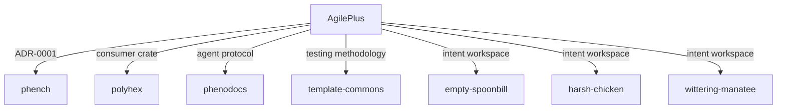

# AgilePlus Absorb — Collection Hub

This repo (`phench`) serves as the **collection / absorb target** for the AgilePlus v0.3.0
workspace and its cross-repo integrations.

## What is collected

| Source | Artifact | Location |
|---|---|---|
| `forge/AgilePlus` | ADR-0001 shard-lock DAG protocol | `docs/adr/0001-shard-lock-dag.md` |
| `forge/AgilePlus` | Ontology spec (12 node types, 12 edge types) | `docs/spec/intent-graph-ontology.md` |
| `forge/AgilePlus` | Ontology expansion research | `docs/research/ontology-expansion.md` |
| `forge/AgilePlus` | Roadmap through v1.0 | `docs/roadmap.md` |
| `~/intent/workspaces/` | Multi-agent intent workspaces × 3 | `intent/workspaces/*/` |
| `~/Repos/polyhex-architecture/` | Rust integration consumer crate | `crates/integrations/agileplus/` |
| `~/Repos/phenodocs/` | Agent protocol registry | `agents.toml`, `agents.lock` |
| `~/Repos/template-commons/` | Testing methodology ADR | `docs/adr/019-shard-lock-dag.md` |

## How to use

```bash
# Pull the latest AgilePlus workspace
cargo install agileplus-cli --version 0.3.0

# Run a full intent-graph lifecycle
agileplus intent --prompt "Design a microservice boundary" --save
agileplus validate
agileplus store --db graphs.db
agileplus list --db graphs.db

# Start the HTTP server
agileplus-server --db graphs.db --addr 127.0.0.1:3000

# Use MCP tools
agileplus-mcp-intent --db graphs.db
```

## Published crates (crates.io)

All 8 AgilePlus crates at v0.3.0:

- `agileplus-domain` — types, builder, query, ops
- `agileplus-trace-validator` — DAG validation, proptest, criterion
- `agileplus-sqlite` — canonical Storage, 4 migrations
- `agileplus-server` — HTTP API, SSE, tags/notes
- `agileplus-mcp-intent` — MCP tools over Storage
- `agileplus-cli` — 12 subcommands
- `agileplus-web` — Leptos CSR frontend
- `agileplus-plugin` — ExternalValidator trait + WASM host

## Cross-repo DAG shape



## Quality gates (verified 2026-06-25)

- 127/127 tests pass
- 0 clippy warnings
- 0 files > 500 lines
- Criterion: ~281 µs for 500-node graph validation
- wasm32-unknown-unknown cross-compile: OK
- Plugin host demo: runs end-to-end
