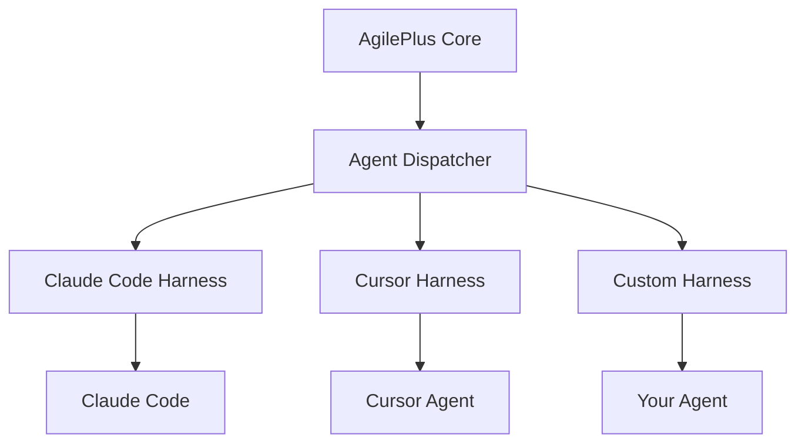

# Harness Integration

How to add a new AI agent harness to AgilePlus.

## What is a Harness?

A harness is the adapter between AgilePlus and a specific AI coding agent (Claude Code, Cursor, Aider, etc.). It handles:

- Prompt delivery
- Response capture
- Session lifecycle management
- Output validation

## Architecture



## Implementing a Harness

### 1. Define the Harness Trait

```rust
pub trait AgentHarness {
    /// Launch a session with the given prompt
    fn dispatch(&self, prompt: &AgentPrompt) -> Result<SessionId>;

    /// Check if the session is still running
    fn is_alive(&self, session: SessionId) -> bool;

    /// Collect output from a completed session
    fn collect(&self, session: SessionId) -> Result<AgentOutput>;

    /// Terminate a running session
    fn terminate(&self, session: SessionId) -> Result<()>;
}
```

### 2. Register the Harness

Add your harness to the dispatcher registry:

```rust
dispatcher.register("my-agent", MyAgentHarness::new(config));
```

### 3. Configure

```toml
# .kittify/config.toml
[agents.my-agent]
harness  = "my-agent"
binary   = "/path/to/agent"
timeout  = "30m"
```

## Testing Your Harness

```bash
agileplus agent test my-agent --prompt "Create a hello world function"
```

This runs a minimal prompt through your harness and validates the output lifecycle.
