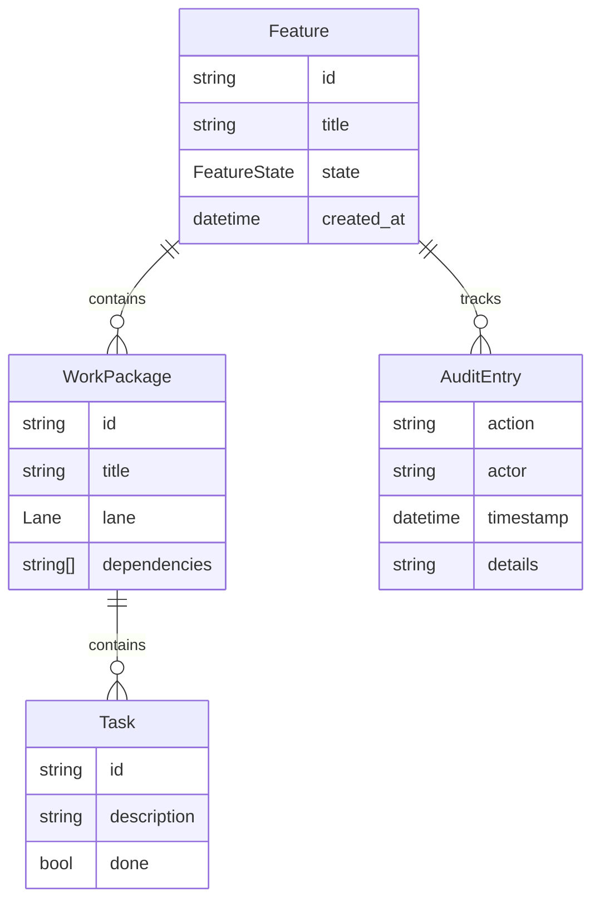

# Domain Model

## Feature

The central entity. Features move through a governed state machine:



```
Draft → Specified → Researched → Planned → Implementing → Validating → Shipped
```

Each feature has:
- Unique ID and slug
- Specification artifact (markdown)
- Work packages (1:N)
- Audit trail entries

## Work Package

A unit of work within a feature:
- Has its own git branch
- Contains subtasks
- Tracks dependencies on other WPs
- Moves through: `planned → doing → for_review → done`

## Audit Entry

Immutable record of every state transition:
- SHA-256 hash chain (each entry references previous)
- Actor identification (human or agent)
- Timestamp, from/to state, metadata

## Backlog Item

Triage output routed to the backlog:
- Intent classification (bug, feature, idea, task)
- Priority scoring (critical → low)
- Status tracking (new → triaged → in_progress → done)
