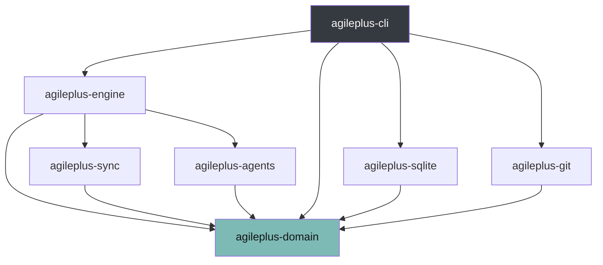

# Architecture Overview

AgilePlus uses a clean architecture with port-based adapters.

## Crate Dependency Graph



Text representation:

```
agileplus-cli
  ├── agileplus-domain    (domain entities, FSM, governance)
  ├── agileplus-sqlite    (StoragePort adapter)
  ├── agileplus-git       (VcsPort adapter)
  ├── agileplus-triage    (classifier, backlog, router)
  ├── agileplus-plane     (Plane.so sync)
  ├── agileplus-github    (GitHub issue sync)
  └── agileplus-subcmds   (sub-command registry, audit)
```

## Port Traits

The domain defines port traits; adapters implement them:

| Port | Trait | Adapters |
|------|-------|----------|
| Storage | `StoragePort` | `SqliteStorageAdapter` |
| VCS | `VcsPort` | `GitVcsAdapter` |
| Agent | `AgentPort` | `StubAgentAdapter` (future: Claude, Codex) |

## Data Flow

```
CLI Input → Command Handler → Domain Service → Port Trait → Adapter → External System
                                    ↓
                              Audit Chain (SHA-256 linked)
```

## Key Design Decisions

- **Rust 2024 edition** workspace with 8 crates
- **SQLite** for local-first storage (no server required)
- **Rule-based triage** (keyword matching with weighted scoring)
- **Token bucket rate limiting** for external API clients
- **SHA-256 content hashing** for sync conflict detection
- **Append-only JSONL** audit trail for sub-command dispatch
