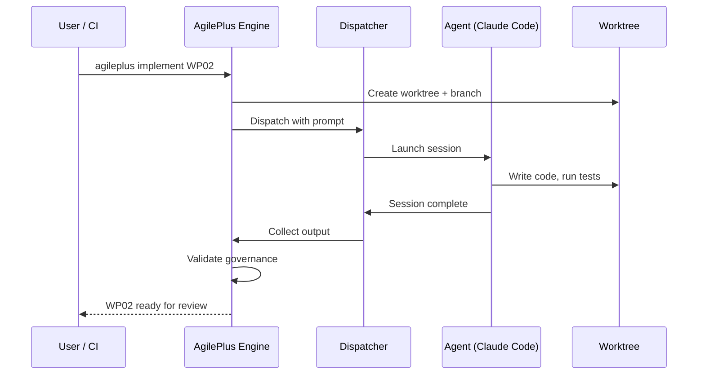

# Agent Dispatch

AgilePlus orchestrates AI coding agents as first-class participants in the development pipeline. Agents receive structured prompts, operate in isolated branches, and are held to the same governance as human developers.



## Supported Agents

| Agent | Integration | Status |
|-------|------------|--------|
| Claude Code | CLI dispatch via `--print` mode | Active |
| Cursor | Rule files + slash commands | Active |
| Codex | Batch execution | Active |
| Copilot | Prompt files in `.github/prompts/` | Active |

## How Dispatch Works

When a work package is ready for implementation:

1. **Prompt generation** — AgilePlus generates a structured prompt from the spec, plan, and WP definition
2. **Branch creation** — An isolated git branch is created for the WP
3. **Agent invocation** — The selected agent receives the prompt and works in the isolated branch
4. **Output capture** — Agent output (code changes, artifacts) is recorded
5. **Validation** — Governance checks run against the agent's output

```
Spec + Plan + WP
       ↓
  Prompt Generator
       ↓
  Agent Harness (Claude / Cursor / Codex)
       ↓
  Isolated Branch
       ↓
  Governance Validation
```

## Agent Harness

Each agent type has a **harness** — an adapter that translates AgilePlus prompts into agent-specific invocations:

- **Claude Code harness**: Invokes `claude --print` with the structured prompt, captures stdout
- **Cursor harness**: Writes `.cursorrules` and slash commands, triggers via workspace
- **Codex harness**: Submits batch jobs with prompt files

The harness abstraction means new agents can be added without changing the core dispatch logic.

## Sub-commands

Agents have access to 25 hidden sub-commands across 8 categories for fine-grained operations:

- **branch**: create, checkout, delete
- **commit**: create, amend, fixup
- **artifact**: write, read, hash
- **governance**: check, enforce

Each sub-command invocation is recorded in an append-only JSONL audit log with pre/post-dispatch entries.

## Review Loop

After agent dispatch, output enters a **review loop**:

1. Automated checks (lint, test, type-check)
2. Coderabbit PR review (if configured)
3. Human review (if required by governance policy)
4. Merge to target branch on approval

The review loop runs automatically — agents don't need to be told to submit for review. The system handles it.
