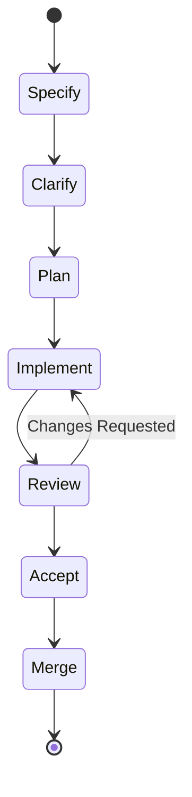
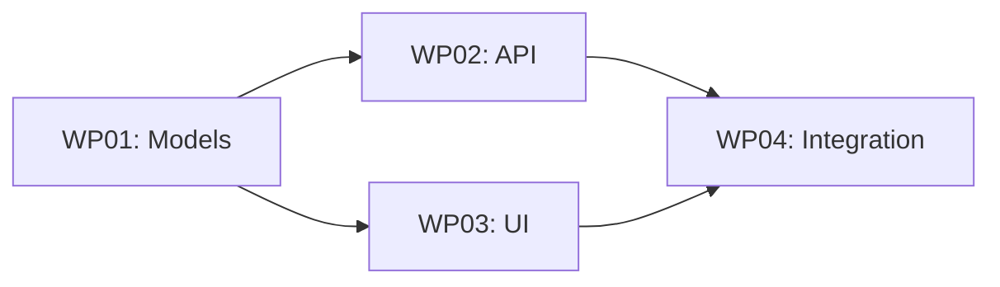

# Feature Lifecycle

Every feature in AgilePlus follows a structured lifecycle from idea to deployment.

## Lifecycle Phases

## Phase Details

### Specify

Transform a feature idea into a structured specification. The spec captures **what** and **why** — never how.

- Input: natural language description
- Output: `spec.md` with requirements, user scenarios, success criteria
- Owner: PM or developer

### Clarify

Identify gaps in the specification through targeted questions. Each clarification is encoded back into the spec.

- Limit: 5 questions per round
- Focus: scope, edge cases, acceptance criteria

### Plan

Generate an implementation blueprint from the specification.

- Output: `plan.md` with architecture decisions, file list, build sequence
- Considers: existing codebase patterns, dependency graph

### Implement

Execute work packages in isolated worktrees. Each WP maps to a branch.

### Review

Structured code review against the plan and coding standards.

- Validates: correctness, test coverage, plan adherence
- Outcome: approve or request changes with specific feedback

### Accept

Final validation that the feature meets spec requirements.

- Runs: acceptance checklist
- Verifies: all success criteria from spec are met

### Merge

Integrate the feature branch into the target branch.

- Handles: worktree cleanup, branch deletion
- Updates: tracker status, changelog
