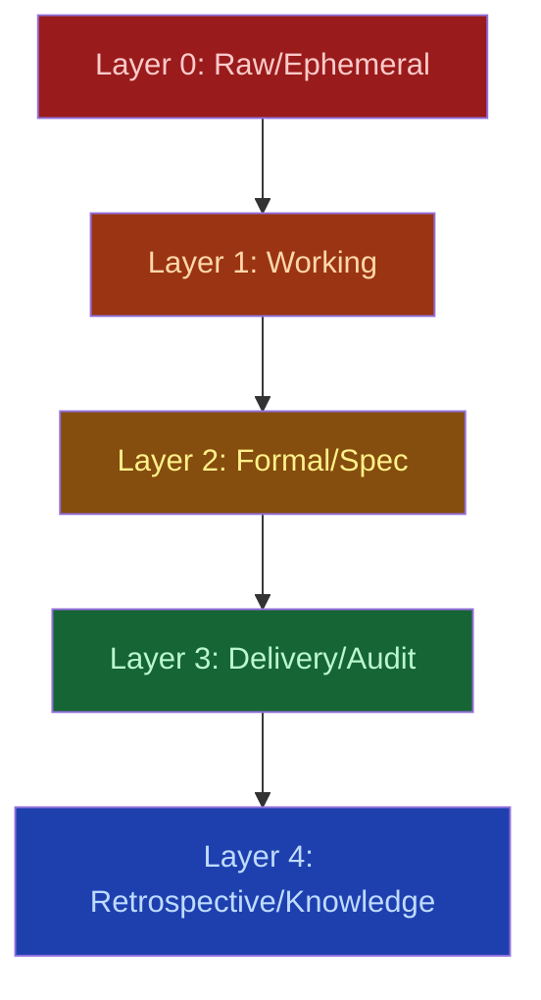

# Documentation Layers

AgilePlus follows the PhenoDocs 5-layer documentation model. Each layer represents a maturity stage for documentation artifacts.

## The Five Layers

### Layer 0 Raw / Ephemeral

Scratch notes, conversation dumps, agent work logs. Not published. Retained for 48–90 days, then promoted or discarded.

| Type | Path | Retention |
|------|------|-----------|
| Conversation dump | `docs/research/CONVERSATION_DUMP_*.md` | 90 days |
| Scratch note | `docs/scratch/YYYYMMDD-*.md` | 48 hours |
| Agent work log | `docs/reference/WORK_STREAM.md` | Permanent |

### Layer 1 Working / Lab

Ideas, research docs, debug logs. Published under `/lab/`. Working documents that may be promoted to formal specs.

| Type | Path | Promotes To |
|------|------|-------------|
| Idea note | `docs/ideas/YYYY-MM-DD-{slug}.md` | Research doc |
| Research doc | `docs/research/{TOPIC}.md` | Design doc / FR |
| Debug log | `docs/debug/YYYY-MM-DD-{issue}.md` | Incident retro |

### Layer 2 Formal / Spec

Source-of-truth documents: PRDs, ADRs, functional requirements, architecture docs. Published under `/docs/`.

| Type | Path | ID System |
|------|------|-----------|
| Spec | `kitty-specs/{NNN}-{slug}/spec.md` | Feature number |
| Plan | `kitty-specs/{NNN}-{slug}/plan.md` | Feature number |
| ADR | `docs/adr/ADR-{NNN}-{slug}.md` | ADR-{NNN} |

### Layer 3 Delivery / Audit

Changelogs, completion reports, sprint plans. Published under `/audit/`. Created automatically from lifecycle events.

| Type | Path | Trigger |
|------|------|---------|
| Changelog | `CHANGELOG.md` | Git tag |
| Completion report | `docs/reports/*-complete.md` | Feature shipped |
| Sprint plan | `docs/sprints/SPRINT-{NN}.md` | Sprint planning |

### Layer 4 Retrospective / Knowledge

Retrospectives, knowledge extracts, lessons learned. Published under `/kb/`. Created after feature completion.

| Type | Path | Trigger |
|------|------|---------|
| Feature retro | `kitty-specs/{NNN}-{slug}/retrospective.md` | Feature shipped |
| Sprint retro | `docs/retros/SPRINT-{NN}-retro.md` | Sprint end |
| Knowledge extract | `docs/kb/{topic}/{slug}.md` | Semantic indexer |

## Layer Progression

Documents flow upward through layers as they mature:

1. **Scratch note** (L0) → promoted to **idea** (L1)
2. **Research doc** (L1) → becomes **spec** (L2)
3. **Spec** (L2) → produces **completion report** (L3) when shipped
4. **Completion report** (L3) → feeds **retrospective** (L4)
