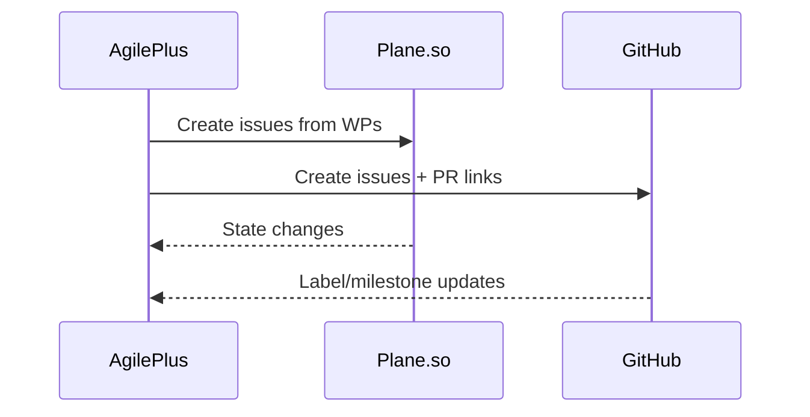

# Sync: Plane.so + GitHub

AgilePlus synchronizes work packages and issues between your project tracker and VCS.

## Supported Integrations

| Platform | Direction | What Syncs |
|----------|-----------|------------|
| **Plane.so** | Bi-directional | Issues, states, labels, assignees |
| **GitHub Issues** | Bi-directional | Issues, labels, milestones |
| **GitHub Projects** | Push only | Cards, status fields |

## Configuration

Add sync targets to your project config:

```toml
# .kittify/config.toml

[sync.plane]
workspace = "my-org"
project   = "my-project"
api_key   = "${PLANE_API_KEY}"

[sync.github]
repo      = "org/repo"
token     = "${GITHUB_TOKEN}"
```

## How It Works

1. **Spec → Issues**: When you run `agileplus plan`, work packages are created as issues in your tracker
2. **Status sync**: Moving a WP to `doing` or `done` updates the tracker issue state
3. **Backflow**: Changes in the tracker (re-prioritization, label changes) sync back to local state



## Running Sync

```bash
agileplus sync              # Full bi-directional sync
agileplus sync --push-only  # Only push local changes
agileplus sync --pull-only  # Only pull remote changes
```

## Conflict Resolution

When both sides change the same field:
- **Last-write wins** for status fields
- **Merge** for labels and tags
- **Local wins** for spec content (specs are source of truth)
