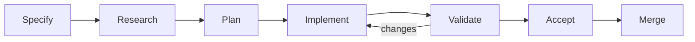

# Workflow

AgilePlus implements a 7-stage spec-driven development pipeline.



## Stages

| Stage | Command | Description |
|-------|---------|-------------|
| 1 | `specify` | Create or revise a feature specification |
| 2 | `research` | Codebase scan or feasibility analysis |
| 3 | `plan` | Generate work packages from spec |
| 4 | `implement` | Execute work packages with agent dispatch |
| 5 | `validate` | Check governance compliance |
| 6 | `ship` | Merge WP branches to main |
| 7 | `retrospective` | Generate post-ship analysis report |

## State Machine

Features transition through states governed by the domain FSM:

```
Draft → Specified → Researched → Planned → Implementing → Validating → Shipped
```

Each transition requires preconditions (e.g., all WPs must pass validation before ship).

## Audit Trail

Every state transition is recorded in the SQLite audit chain with:

- Timestamp
- Actor (human or agent)
- From/to state
- Artifact hash (SHA-256)
- Governance metadata
