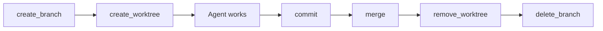

# VCS Port API

The `VcsPort` trait abstracts version control operations, allowing AgilePlus to work with different VCS backends.

## Trait Definition

```rust
pub trait VcsPort: Send + Sync {
    /// Create a new branch from a base
    fn create_branch(&self, name: &str, base: &str) -> Result<()>;

    /// Delete a branch
    fn delete_branch(&self, name: &str) -> Result<()>;

    /// Create a worktree for isolated development
    fn create_worktree(&self, path: &Path, branch: &str) -> Result<()>;

    /// Remove a worktree
    fn remove_worktree(&self, path: &Path) -> Result<()>;

    /// Stage and commit files
    fn commit(&self, message: &str, files: &[PathBuf]) -> Result<CommitId>;

    /// Merge a source branch into a target
    fn merge(&self, source: &str, target: &str) -> Result<MergeResult>;

    /// Get the current branch name
    fn current_branch(&self) -> Result<String>;

    /// Check if the working tree is clean
    fn is_clean(&self) -> Result<bool>;

    /// List commits between two refs
    fn log(&self, from: &str, to: &str) -> Result<Vec<Commit>>;
}
```

## Built-in Implementations

### GitVcs

The default implementation wraps `git` CLI commands:

```rust
let vcs = GitVcs::new("/path/to/repo")?;
vcs.create_branch("feat/001-login-WP01", "main")?;
vcs.create_worktree(
    Path::new(".worktrees/001-login-WP01"),
    "feat/001-login-WP01",
)?;
```

## Key Types

```rust
pub struct CommitId(pub String);  // SHA hash

pub struct Commit {
    pub id: CommitId,
    pub message: String,
    pub author: String,
    pub timestamp: DateTime<Utc>,
}

pub enum MergeResult {
    Success { commit: CommitId },
    Conflict { files: Vec<PathBuf> },
}
```

## Worktree Lifecycle


