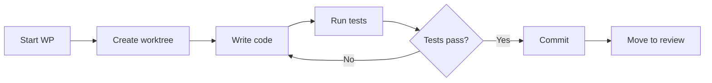

# Implement

Create an isolated workspace and execute a work package.

## What It Does

1. Creates a **git worktree** with a dedicated branch
2. Provides the agent/developer with the WP prompt
3. Tracks progress through subtask completion
4. Validates governance constraints on completion

## Usage

```bash
agileplus implement WP01
# or with agent dispatch:
agileplus implement WP01 --agent claude-code
```

## Worktree Isolation

Each WP gets its own working directory:

```
.worktrees/
└── 001-feature-WP01/
    ├── src/           # Full project copy
    ├── tests/
    └── ...
```

This ensures:
- No interference between parallel WPs
- Clean diff against main for review
- Easy cleanup after merge

## Workflow



## Completion

When implementation is done:

```bash
cd .worktrees/001-feature-WP01
git add -A
git commit -m "feat(WP01): implement data models"
agileplus move WP01 --to for_review
```

The move command validates that the worktree has commits beyond main before allowing the transition.
