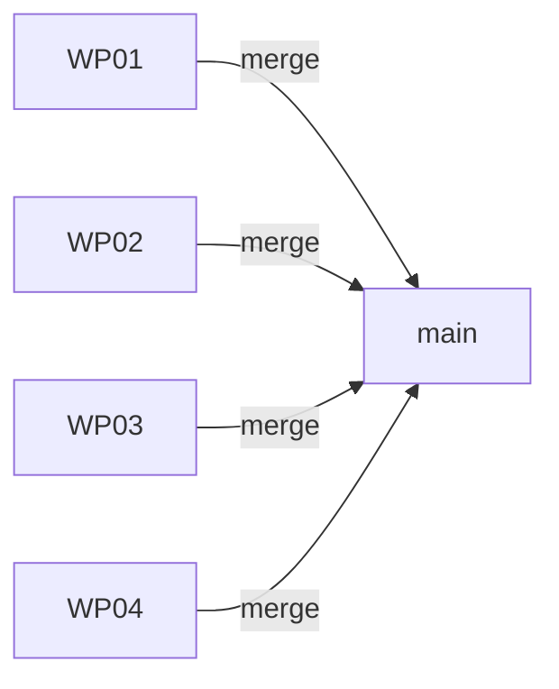

# Merge

Integrate a completed feature into the target branch and clean up.

## What It Does

1. Merges all WP branches into the target branch (usually `main`)
2. Removes worktrees
3. Deletes feature branches
4. Updates tracker status

## Usage

```bash
agileplus merge 001
```

## Merge Strategy

AgilePlus merges WP branches in dependency order:



Each merge is a fast-forward or squash merge (configurable). Conflicts are surfaced immediately.

## Cleanup

After merge:
- `.worktrees/001-feature-*` directories removed
- `feat/001-feature-*` branches deleted
- Feature state updated to `Shipped`
- Tracker issues closed
