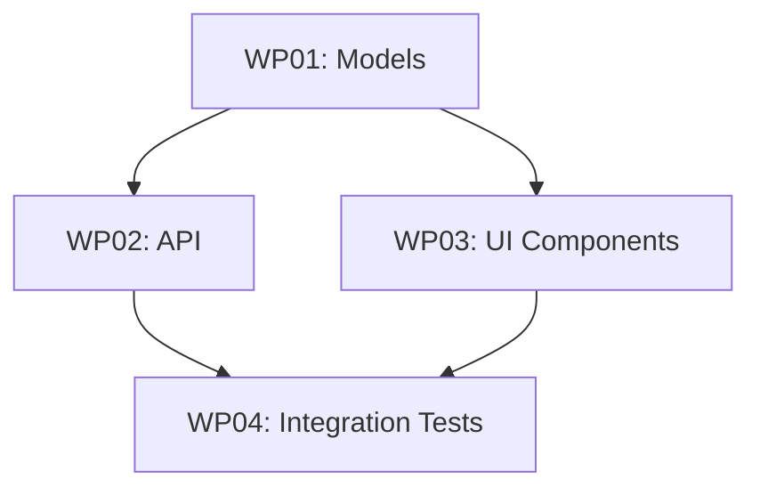

# Tasks & Work Packages

Decompose a plan into grouped work packages with subtasks and prompt files.

## What It Does

1. Reads the plan and spec
2. Groups related work into **work packages** (WPs)
3. Defines dependencies between WPs
4. Generates prompt files for agent dispatch

## Usage

```bash
agileplus tasks 001
```

## Output

```
kitty-specs/001-feature/
└── tasks/
    ├── WP01-models.md
    ├── WP02-api.md
    ├── WP03-ui.md
    └── WP04-integration.md
```

## Work Package Structure

Each WP contains:

- **Title** and description
- **Subtasks** — checkable items
- **Dependencies** — which WPs must complete first
- **Deliverables** — files and artifacts to produce
- **Lane** — current kanban position (`planned` → `doing` → `for_review` → `done`)

## Dependency Graph



WPs without dependencies can run in parallel. The system enforces that blocked WPs cannot start until their dependencies are complete.

## Kanban Lanes

| Lane | Meaning |
|------|---------|
| `planned` | Ready to start (dependencies met) |
| `doing` | Currently being implemented |
| `for_review` | Implementation complete, awaiting review |
| `done` | Reviewed and approved |
